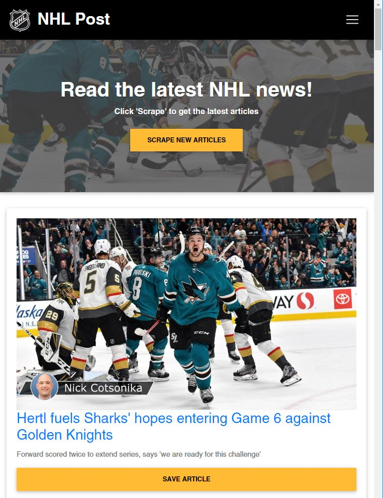
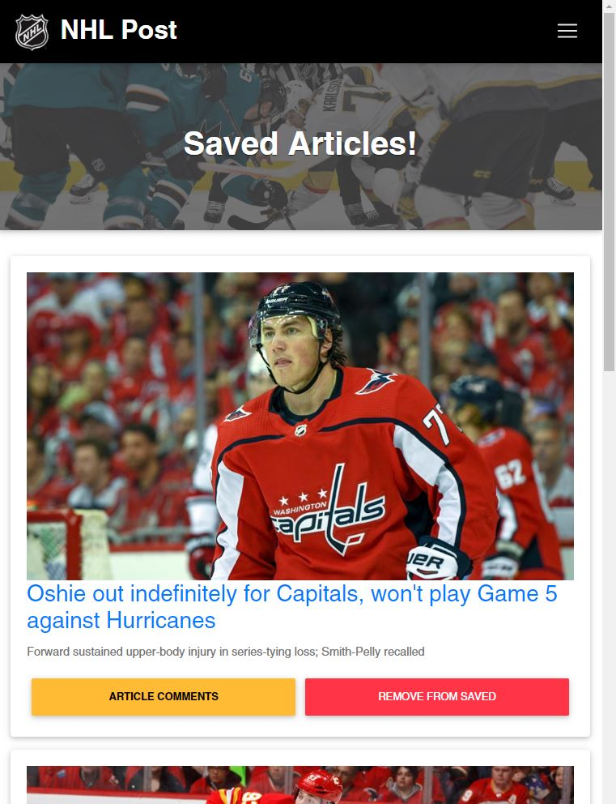

# NHL Post

NHL Post is a full stack application that lets users scrape news articles from NHL.com. Users can save articles and then are given the option to view and add commments to those saved articles. The user also has the option to remove an article from the saved articles. This `Express` app uses the `MVC design` pattern, `Cheerio` to scrape news articles from NHL.com, `Mongoose` to store data in `MongoDB` and `Handlebars` to generate the HTML. 

Click [here]( ) to view the deployed app on Heroku.

## Local Deployment
1. Clone repo and run `npm install` to download app dependencies.
2. Ensure `MongoDB` is downloaded and running.
3. Go to `server.js` and update the mongodb connection with host/port/database, if needed.
4. Run the app in `localhost:3000` in your browser. ("http://localhost:3000")

## Screen Shots

---

## Technology/Dependencies 
* JavaScript: https://www.javascript.com/
* Node.js: https://nodejs.org/en/
* MongoDB: https://www.mongodb.com/download-center#community
* Mongoose: http://mongoosejs.com/docs/
* Express: https://www.npmjs.com/package/express
* Express-Handlebars: https://www.npmjs.com/package/express-handlebars
* Cheerio: https://www.npmjs.com/package/cheerio
* Morgan: https://www.npmjs.com/package/morgan
* Method-Override: https://www.npmjs.com/package/method-override
* Material Design for Bootstrap (Add CDN in HTML): https://mdbootstrap.com/docs/jquery/
